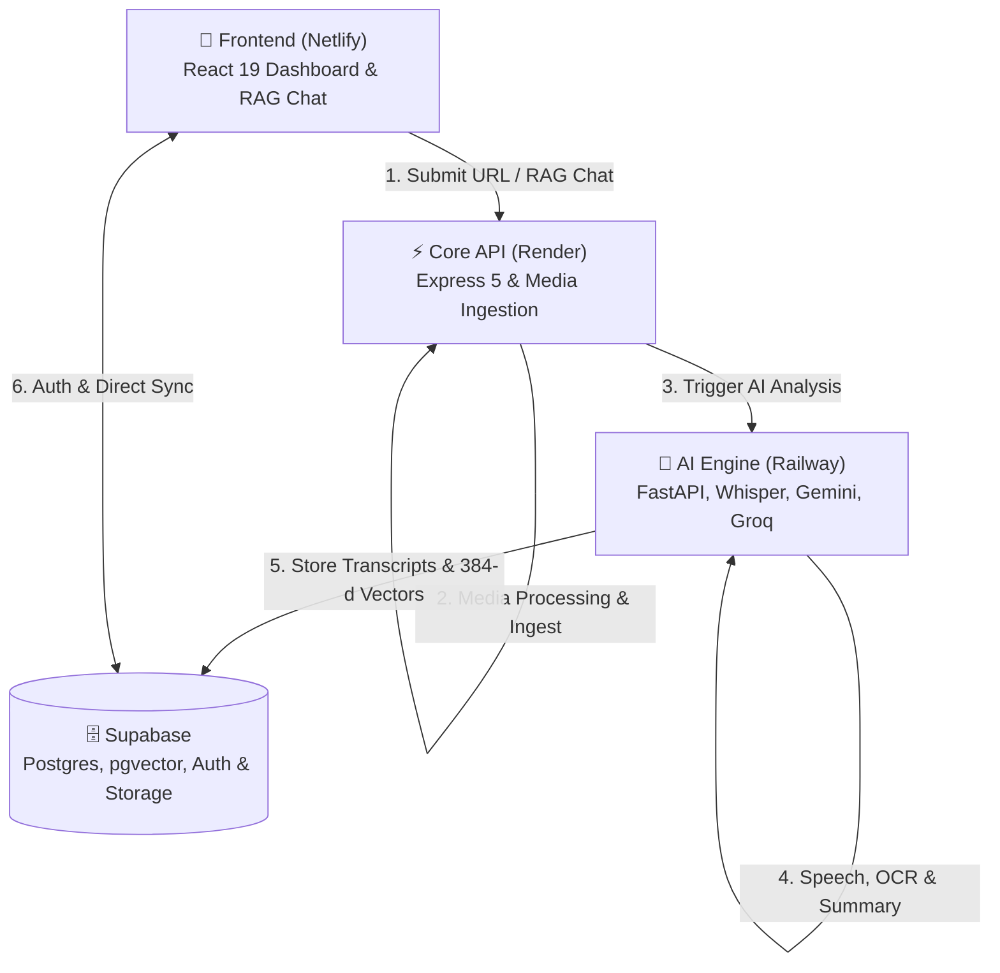
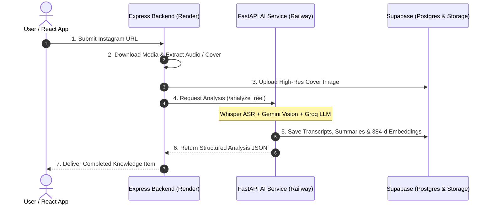

<div align="center">

  <br />
  <h1>🧠 SuperBrain</h1>
  <p align="center">
    <strong>Turn Saved Instagram Reels & Posts into a Searchable, Conversational AI Knowledge Base</strong>
  </p>

  <p align="center">
    <a href="https://mysuperbrain.netlify.app/dashboard">
      
    </a>
    <a href="https://superbrain-api-m8c8.onrender.com">
      
    </a>
    <a href="https://github.com/Dhruuvvv/SuperBrain/stargazers">
      
    </a>
  </p>

  <p align="center">
    
    
    
    
    
    
    
  </p>

  <br />

</div>

---

## 📖 Executive Summary

**SuperBrain** bridges the gap between passive content consumption and active knowledge retention. Users save dozens of insightful Instagram Reels, code walkthroughs, design tips, and product reviews daily—only for them to be lost in an unorganized saved tab.

SuperBrain automatically ingests Instagram URLs, downloads high-resolution media, transcribes multi-lingual audio (Hinglish/Hindi/English) via **OpenAI Whisper**, extracts visual context & OCR via **Google Gemini Flash**, synthesizes key takeaways & how-to guides using **Groq (Llama 3.3 70B)**, and indexes 384-dimensional vector embeddings in **Supabase Vector**.

The result is a unified dashboard with **instant semantic search**, **AI-powered multi-document chat**, and **interactive mind maps** for every saved piece of knowledge.

---

## ✨ Key Capabilities

| Capability | Technical Mechanism | Benefit |
| :--- | :--- | :--- |
| 🔗 **Instagram Ingestion Engine** | Automated `yt-dlp` cross-platform pipeline with Netscape cookie authentication & 429 mitigation | Ingests Reels, IGTV, Photos, and Carousels without rate limit failures |
| 🎙️ **Speech-to-Text (ASR)** | OpenAI Whisper / `Oriserve/Whisper-Hindi2Hinglish-Prime` | Generates word-level accurate Hinglish & English transcripts + SRT files |
| 👁️ **Visual OCR & Object Extraction** | Google Gemini 1.5 Flash Vision Multimodal Pipeline | Reads code snippets, screen text, tools, brand names, and visual step-by-step actions |
| ⚡ **Ultra-Fast LLM Synthesis** | Groq Llama 3.3 70B Versatile Engine | Generates structured JSON metadata, actionable takeaways, and interactive step-by-step guides in < 2s |
| 🔍 **Hybrid Vector & Keyword Search** | SentenceTransformers (`all-MiniLM-L6-v2`) + Supabase `pgvector` | Search by concept (e.g. *"React performance tricks"*) rather than exact keyword matches |
| 💬 **Conversational AI Knowledge Assistant** | RAG (Retrieval-Augmented Generation) Chat Engine | Ask questions across all saved reels with context-backed answers and source citations |
| 🗺️ **Interactive Mind Map Generation** | Dynamic Mermaid graph generation & visual node hierarchy | Visualize knowledge structures and topic relationships interactively |
| 🛡️ **Enterprise Security & Auth** | Supabase Auth with RLS & Service Role isolation | Secure, encrypted user authentication and individual data isolation |

---

## 🏗️ Multi-Service Architecture

SuperBrain utilizes a decoupled 3-tier microservice architecture designed for scale, high throughput, and resilience across heterogenous cloud providers (**Netlify**, **Render**, and **Railway**).



### 🔄 End-to-End Media Ingestion & Processing Sequence



---

## 🛠️ Complete Tech Stack

### Frontend Application
- **Framework**: React 19.0, Vite 6.0
- **Styling**: Tailwind CSS v4, Vanilla CSS Design System
- **State & Router**: React Context, React Router DOM v7
- **Icons & Visuals**: Lucide React, FontAwesome
- **Deployment**: Netlify (`https://mysuperbrain.netlify.app`)

### Express Core Backend
- **Runtime**: Node.js v22.x, Express 5.x
- **Media Engine**: `yt-dlp` (Auto-provisioned cross-platform binary with HTTP 429 rate limit mitigations), `gallery-dl`, `FFmpeg`
- **Security & Utilities**: CORS, `express-rate-limit`, Netscape Cookie Handler
- **Deployment**: Render Web Service (`https://superbrain-api-m8c8.onrender.com`)

### FastAPI AI Engine
- **Framework**: Python 3.11, FastAPI, Uvicorn, Pydantic v2
- **ASR & Transcribe**: `Oriserve/Whisper-Hindi2Hinglish-Prime`, OpenAI Whisper API, Groq Whisper
- **Vision & LLM**: Google GenAI (`gemini-1.5-flash`), Groq SDK (`llama-3.3-70b-versatile`)
- **Embeddings**: `sentence-transformers/all-MiniLM-L6-v2` (PyTorch CPU/CUDA)
- **Search Verification**: Serper API (Official site verification)
- **Deployment**: Railway Container Service

### Database, Auth & Vector Store
- **Platform**: Supabase
- **Database**: PostgreSQL 15+ with `pgvector` extension enabled
- **Authentication**: Supabase Auth (JWT & Session Management)
- **Object Storage**: Supabase Storage (`thumbnails` bucket)

---

## ⚡ Quick Start & Local Setup

### Prerequisites

Ensure you have the following installed locally:
- **Node.js**: `>= 18.0.0`
- **Python**: `>= 3.10`
- **FFmpeg**: Installed and added to system `PATH`
- **Git**: Installed

---

### 1. Repository Setup

```bash
# Clone the repository
git clone https://github.com/Dhruuvvv/SuperBrain.git
cd SuperBrain
```

---

### 2. Configure Environment Variables

Create `.env` files in each service directory:

#### `client/.env`
```env
VITE_SUPABASE_URL=https://your-supabase-project.supabase.co
VITE_SUPABASE_ANON_KEY=your_supabase_anon_key
VITE_API_BASE_URL=http://localhost:5000
```

#### `server/.env`
```env
PORT=5000
SUPABASE_URL=https://your-supabase-project.supabase.co
SUPABASE_SERVICE_KEY=your_supabase_service_role_key
PYTHON_SERVICE_URL=http://localhost:8000
INSTAGRAM_COOKIES=base64_or_netscape_cookie_string
RENDER_EXTERNAL_URL=http://localhost:5000
```

#### `ai_server/.env`
```env
GEMINI_API_KEY=your_google_gemini_api_key
GROQ_API_KEY=your_groq_api_key
SERPER_API_KEY=your_serper_api_key
SUPABASE_URL=https://your-supabase-project.supabase.co
SUPABASE_SERVICE_ROLE_KEY=your_supabase_service_role_key
```

---

### 3. Install & Run Services

#### **Terminal 1: Express Core Server**
```bash
cd server
npm install
npm run start
```
*(Server will start on `http://localhost:5000`)*

#### **Terminal 2: FastAPI AI Server**
```bash
cd ai_server
pip install -r requirements.txt
uvicorn main:app --host 0.0.0.0 --port 8000 --reload
```
*(AI Engine will start on `http://localhost:8000`)*

#### **Terminal 3: React Frontend**
```bash
cd client
npm install
npm run dev
```
*(Frontend will start on `http://localhost:5173`)*

---

## 📁 Repository Directory Tree

```
SuperBrain/
├── 📂 client/                          # React 19 Frontend App
│   ├── 📂 src/
│   │   ├── 📂 components/              # UI Components (Navbar, Cards, Modals, MindMap)
│   │   ├── 📂 pages/                   # Views (Dashboard, Chat, Library, Settings)
│   │   ├── 📂 services/                # API Services & Supabase Client
│   │   └── App.jsx
│   ├── index.html
│   ├── vite.config.js
│   └── package.json
│
├── 📂 server/                          # Express 5 Node.js API Service
│   ├── 📂 services/
│   │   └── downloadService.js          # Cross-Platform yt-dlp & FFmpeg Downloader
│   ├── postinstall.js                  # Linux yt-dlp binary auto-provisioner
│   ├── server.js                       # Express Core API Routes & Endpoints
│   └── package.json
│
├── 📂 ai_server/                       # Python FastAPI Microservice
│   ├── 📂 routes/                      # Endpoints (/analyze_reel, /chat, /mindmap, /transcribe)
│   ├── 📂 services/                    # Whisper, Gemini, Groq & Embedding Engines
│   ├── 📂 utils/                       # Validation, Cache & Hallucination Checks
│   ├── main.py                         # FastAPI App Entrypoint
│   └── requirements.txt
│
├── 📂 pipelines/                       # System Workflow Diagrams & SVG Assets
└── 📄 README.md                        # Documentation
```

---

## 🌐 Live Deployments

| Service | Hosting Platform | URL / Access | Status |
| :--- | :--- | :--- | :--- |
| **Frontend Web App** | Netlify | [https://mysuperbrain.netlify.app](https://mysuperbrain.netlify.app/dashboard) |  |
| **Express Backend API** | Render | `Private API Endpoint` |  |
| **FastAPI AI Server** | Railway | `Internal Microservice` |  |
| **Database & Storage** | Supabase | `Secured via RLS` |  |
---

## 🤝 Contributing

Contributions are welcome! Please follow these steps:

1. **Fork** the project repository ([https://github.com/Dhruuvvv/SuperBrain](https://github.com/Dhruuvvv/SuperBrain))
2. **Create** your feature branch (`git checkout -b feature/AmazingFeature`)
3. **Commit** your changes (`git commit -m 'feat: Add AmazingFeature'`)
4. **Push** to the branch (`git push origin feature/AmazingFeature`)
5. **Open** a Pull Request

---

## 📄 License

This project is licensed under the **MIT License**. See the [`LICENSE`](LICENSE) file for details.

---

<div align="center">

  <h3>Built with ❤️ by Dhruv Jariwala</h3>

  <p>
    <a href="https://github.com/Dhruuvvv">
      
    </a>
    <a href="https://mysuperbrain.netlify.app/dashboard">
      
    </a>
  </p>

  <p>⭐ <strong>If you find SuperBrain useful, consider giving it a star on GitHub!</strong> ⭐</p>

</div>
